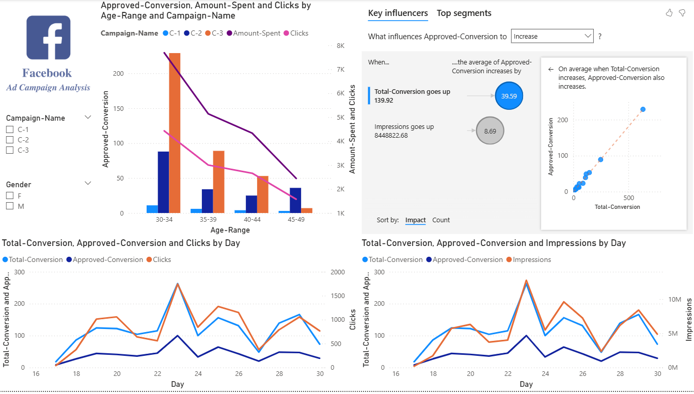

# 📢 Facebook Ad Campaign Analysis – Power BI Dashboard

## 📌 Overview

This Power BI dashboard provides a detailed analysis of **Facebook ad campaign performance**, focusing on metrics like **approved conversions**, **amount spent**, **clicks**, and **impressions** across different **age ranges**, **campaign names**, **genders**, and **time periods**. The goal is to help digital marketers and advertisers evaluate ad effectiveness and optimize campaigns based on demographic and behavioral data.

---

## 🎯 Business Objectives

- Identify which **age groups** and **genders** respond best to campaigns.
- Analyze **conversion behavior** across campaigns (C-1, C-2, C-3).
- Track daily trends in **clicks**, **conversions**, and **impressions**.
- Understand key drivers of **Approved Conversions** using AI-driven analysis.
- Optimize future ad spend and targeting strategy.

---

## 📊 Key Metrics Tracked

| Metric             | Description |
|--------------------|-------------|
| ✅ Approved Conversion | Final conversions after review/validation |
| 🔁 Total Conversion     | All conversions attempted |
| 💸 Amount Spent        | Total ad spend per group/campaign |
| 🖱️ Clicks              | Number of ad clicks |
| 👁️ Impressions         | Number of times ads were shown |

---

## 📌 Dashboard Features

### 📈 Visuals

- **Stacked Column + Line Chart**  
  Approved Conversions, Clicks, and Amount Spent across **Age Ranges (30–49)** and **Campaigns (C-1, C-2, C-3)**

- **Line Chart 1**  
  Daily trend of **Total Conversions, Approved Conversions, and Clicks**

- **Line Chart 2**  
  Daily trend of **Total Conversions, Approved Conversions, and Impressions**

- **AI Key Influencers Visual**  
  Automatically detects what impacts **Approved Conversions**, highlighting that:
  - When **Total Conversion** increases, Approved Conversion goes up by **~39.59**
  - **Impressions** also positively correlate with conversion lift

- **Scatter Plot Insight**  
  Shows a strong positive correlation between **Total Conversion** and **Approved Conversion**

### 🧰 Filters / Slicers

- Campaign Name selector: C-1, C-2, C-3  
- Gender filter: Male (M), Female (F)

---

## 🔍 Insights Derived

- **Age 30–34** performs best across all campaigns with high conversions and clicks.
- **Campaign C-2** dominates spend and approved conversions, especially in younger age groups.
- **Impressions and Total Conversions** are the two strongest influencers of final conversions.
- Daily data shows conversion spikes around specific campaign days, useful for future timing strategy.

---

## 🛠 Tech Stack

- **Power BI Desktop**
- Power Query for data transformation
- DAX for calculated fields
- AI Visuals (Key Influencer)
- Combination charts: line + column, dual axes, scatter plots

---

## 📁 Files Included

| File | Description |
|------|-------------|
| `Facebook_Ad_Campaign_Analysis.pbix` | Main Power BI dashboard file |
| `dashboard.png` | Screenshot of the dashboard |

---

## 🖼️ Dashboard Screenshot

  

---

## 👤 Author

**Shivam**  
📧 [shivam050205@gmail.com](mailto:shivam050205@gmail.com)  
🔗 [LinkedIn](https://www.linkedin.com/in/shivam-624172256/)  
🔗 [GitHub](https://github.com/Shivam-knight-owl)

---

